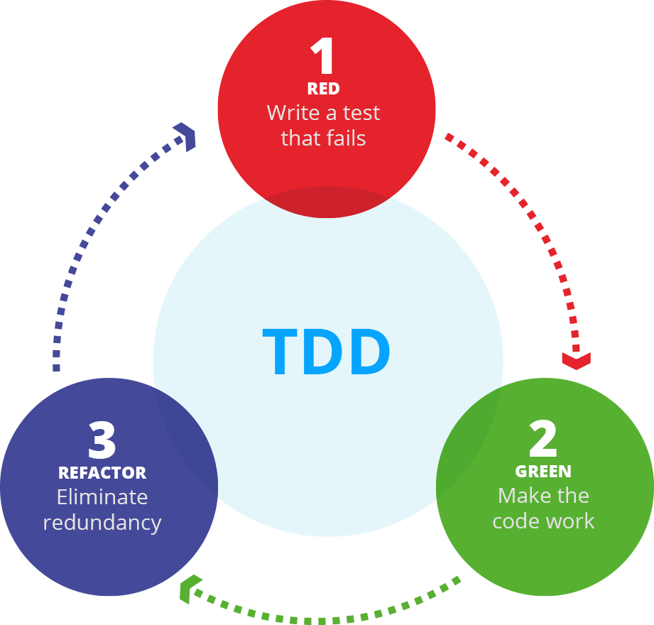

# Python Packaging, Unit Testing, and Integration Testing

This repository contains notebook-based modules and Python files covering Python modules and packages, unit testing with `pytest`, testing data workflows, integration testing across file and database boundaries, and decorators for reusable validation logic.

<div align="center">
  
  <p><em>Source: <a href="https://www.xeridia.co.uk/blog/benefits-test-driven-development-devops-environments" target="_blank" rel="noopener noreferrer">Benefits of Test-Driven Development in DevOps Environments</a> by Emiliano Sutil, Xeridia.</em></p>
</div>

## Learning Objectives

By the end of this repository, you should be able to:

- Structure and install a source-layout Python project so its modules can be imported and reused as a standard package.
- Write unit tests for data-processing functions with `pytest`, including parametrized edge cases and fixture-based dataset checks.
- Write integration tests that validate end-to-end file and SQLite data workflows, including returned values and persisted outputs.

## Learning Path

Each module lives in its own self-contained folder with the notebook, related `src/` files, tests, and any module-specific data.

### 01 - Intro to Python Packaging

| File | Description |
|---|---|
| [**01 - Intro to Python Packaging**](01-intro-to-python-packaging/01-intro-to-python-packaging.ipynb) | Packaging fundamentals and source-layout imports. |
| [**Source Code**](01-intro-to-python-packaging/src/) | The `example` package and its `add_one()` implementation target. |

### 02 - Intro to Unit Testing

| File | Description |
|---|---|
| [**02 - Intro to Unit Testing**](02-intro-to-unit-testing/02-intro-to-unit-testing.ipynb) | Core `pytest` patterns and small implementation targets. |
| [**Source Code**](02-intro-to-unit-testing/src/) | Division, palindrome, and email-generation implementation targets. |
| [**tests**](02-intro-to-unit-testing/tests/) | `pytest` test modules for each implementation target. |

### 03 - Testing in Data Science

| File | Description |
|---|---|
| [**03 - Testing in Data Science**](03-testing-in-data-science/03-testing-in-data-science.ipynb) | Pandas-oriented checks for imputation and transformations. |
| [**Source Code**](03-testing-in-data-science/src/) | Imputation and transformation implementation targets. |
| [**tests**](03-testing-in-data-science/tests/) | `pytest` test modules validating pandas `Series` and `DataFrame` outputs. |
| [**data**](03-testing-in-data-science/data/) | Sample dataset with missing values used by the imputation exercises. |

### 04 - Intro to Integration Testing

| File | Description |
|---|---|
| [**04 - Intro to Integration Testing**](04-intro-to-integration-testing/04-intro-to-integration-testing.ipynb) | Integration checks across file and SQLite workflows. |
| [**Source Code**](04-intro-to-integration-testing/src/) | CSV and SQLite pipeline implementation targets. |
| [**tests**](04-intro-to-integration-testing/tests/) | Integration test modules for the CSV and database pipelines. |

### 05 - Intro to Decorators

| File | Description |
|---|---|
| [**05 - Intro to Decorators**](05-intro-to-decorators/05-intro-to-decorators.ipynb) | Closures, decorators, and a parameterized decorator target. |
| [**Source Code**](05-intro-to-decorators/src/) | The parameterized type-check decorator implementation target. |
| [**tests**](05-intro-to-decorators/tests/) | `pytest` test modules for the decorator target. |

### Additional Folders and Files

| File / Folder | Description |
|---|---|
| [**assets**](assets/) | Visual aids referenced in the notebooks. |
| [**pyproject.toml**](pyproject.toml) | Project configuration and dependencies. |
| [**uv.lock**](uv.lock) | Dependency lock file. |

## Setup

> [!NOTE]
> Throughout these steps, text in angle brackets like `<repo-name>` is a **placeholder**. Replace it, including the `< >` brackets, with your own value. For example, `cd <repo-name>` becomes `cd my-testing-project`.

### 1. Create the Repository from the Template

Click **Use this template** on GitHub.

When creating the repository:

- Set yourself as the **Owner**
- Choose a repository name
- Disable **Include all branches**
- Click **Create repository**

> [!IMPORTANT]
> If you are working in pairs or groups, only **one person** should complete this step.

---

### 2. Add Collaborators (Pairs/Groups Only)

If working with teammates:

1. Open the repository on GitHub
2. Go to **Settings → Collaborators**
3. Add your teammates as collaborators
4. Share the repository link with your team

Teammates should accept the invitation before continuing.

---

### 3. Clone the Repository

Copy the SSH URL from the **Code** button on GitHub, then run:

```bash
git clone <copied-ssh-url>
```

The copied SSH URL will look like `git@github.com:<your-username>/<repo-name>.git`.

---

### 4. Move into the Project Folder and Install Dependencies

This installs all dependencies and creates a virtual environment in `.venv/`.

```bash
cd <repo-name>
uv sync
```

---

### 5. Open the Notebooks

> [!NOTE]
> Make sure you open VS Code from the project root so it automatically detects the environment created by `uv sync`.

Launch VS Code in the project root folder:

```bash
code .
```

Then open a notebook and select the Python environment created by `uv sync` as the kernel.

## Expected State From Scratch

After running `uv sync` (see Setup above), the repository is expected to behave like this before any implementation targets are completed:

| Module | Expected initial state |
| --- | --- |
| [01-intro-to-python-packaging](01-intro-to-python-packaging) | The primary `add_one()` validation fails until [src/example/example_file.py](01-intro-to-python-packaging/src/example/example_file.py) is implemented. |
| [02-intro-to-unit-testing](02-intro-to-unit-testing) | [tests/test_division.py](02-intro-to-unit-testing/tests/test_division.py) passes; palindrome and email checks fail; reference checks pass. |
| [03-testing-in-data-science](03-testing-in-data-science) | Imputation and reference checks pass; transformation target checks fail. |
| [04-intro-to-integration-testing](04-intro-to-integration-testing) | Both integration-test modules fail until the pipeline methods are implemented. |
| [05-intro-to-decorators](05-intro-to-decorators) | [tests/test_type_check.py](05-intro-to-decorators/tests/test_type_check.py) fails; [tests/test_type_check_solution.py](05-intro-to-decorators/tests/test_type_check_solution.py) passes. |

## Validation Workflow

The `.venv/` environment is already created by `uv sync` (see Setup above). Run validation commands from inside the module folder you are working on. The notebooks and source-file TODO blocks use explicit interpreter paths so the commands behave the same way without relying on shell activation.

Example:

```bash
cd 02-intro-to-unit-testing
../.venv/bin/python -m pytest -q tests/test_division.py
```

These commands assume your current working directory is the module folder, because imports are resolved from that module layout.

Running `pytest -q tests` inside a module that contains incomplete implementation targets will fail until those targets are completed. Use the module notebook to see which checks are expected to pass immediately and which ones are expected to fail at the start.

## Python Files In This Repo

Most files under `src/` are Python modules that are imported by notebooks and tests. In this repository, you will usually validate those files by importing from them or by running tests against them, not by calling `python some_file.py` directly.

Example from `01-intro-to-python-packaging/`:

```bash
cd 01-intro-to-python-packaging
../.venv/bin/python -c "from src.example.example_file import add_one; print(add_one(3))"
```

That command proves the import path works and shows the function's current output.

The validation command for the same module is:

```bash
cd 01-intro-to-python-packaging
../.venv/bin/python -c "from src.example.example_file import add_one; assert add_one(3) == 4"
```

That command is expected to fail until `add_one()` is implemented correctly. Tests work the same way at a larger scale: they import functions and classes, run them, and compare the result with the expected output.

`__init__.py` marks a directory as a Python package so Python can import modules from it with dotted paths such as `src.example.example_file`. In this repository, `__init__.py` is mainly there to make package structure explicit. You generally do not need to edit it for these modules.

## Troubleshooting

- If `python` or `pytest` is not found, run `uv sync` from the repo root first.
- If notebook imports fail, run the notebook bootstrap cell near the top of the notebook before importing from `src`.
- If you want printed output during tests, add `-s`, for example:
  - `../.venv/bin/python -m pytest -q -s tests/test_type_check.py`
